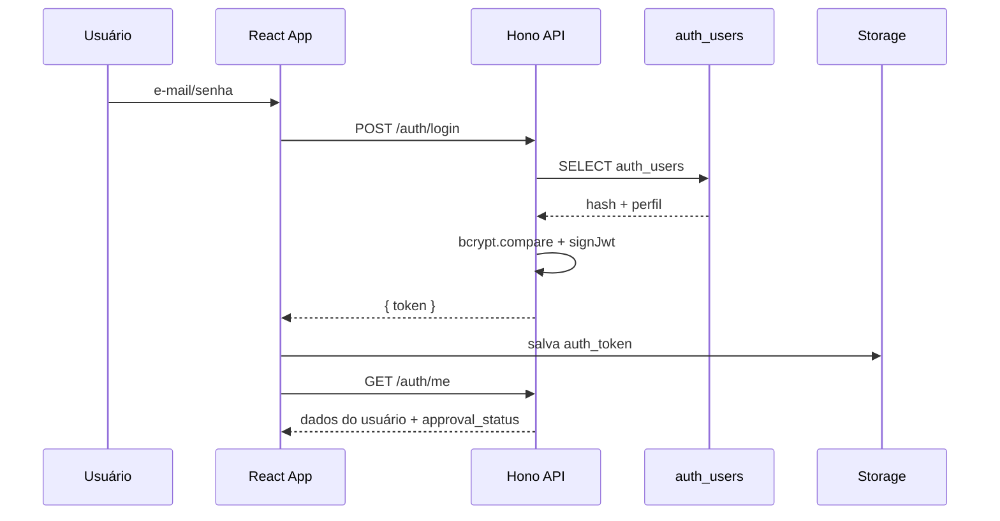

# 1. Arquitetura e Estrutura de Código

## 1.1 Objetivo
Descrever como o uRede está organizado em camadas, quais tecnologias compõem o stack e como o código-fonte foi estruturado para suportar operações de credenciamento, escalonamento e auditoria.

## 1.2 Visão em camadas

```mermaid
graph LR
  subgraph Cliente (SPA React)
    UI[App.tsx<br/>Layout/Dashboard/Pedidos]
    Docs[Documentação embutida<br/>(/documentacao/usuarios)]
  end
  subgraph API (Hono/Deno)
    Auth[/Auth & Aprovação/]
    Pedidos[/Pedidos & Importação/]
    Alertas[/Alertas & Auditoria/]
    Config[/Configurações & Cobertura/]
  end
  subgraph Banco de Dados
    Postgres[(Postgres gerenciado)]
    SQLite[(SQLite local, opcional)]
  end
  Emails[(Brevo SMTP)]
  Cron[Escalonador
(setInterval + POST /)]

  UI -->|JWT + fetch| Auth
  UI --> Pedidos
  UI --> Alertas
  Docs --> UI
  Auth --> Postgres
  Pedidos --> Postgres
  Alertas --> Postgres
  Config --> Postgres
  Cron --> Pedidos
  Alertas --> Emails
```

- **Frontend (React 18 + Vite 6):** SPA que controla autenticação, dashboards, lista de pedidos, formulários, importação em lote e páginas de documentação para usuários.
- **API (Deno 1.41 + Hono 4):** única aplicação `database/functions/server/index.tsx` que expõe endpoints REST com autenticação JWT local, RBAC e integrações externas (Brevo, scheduler).
- **Banco:** ambiente padrão roda em Postgres gerenciado (`DB_DRIVER=postgres` + `DATABASE_DB_URL`). SQLite (`data/urede.db`) permanece como opção apenas para desenvolvimento isolado.
- **Alertas e e-mail:** eventos de pedido geram registros em `urede_alertas` e notificações via Brevo (configurável por variáveis de ambiente).
- **Escalonamento:** executado automaticamente a cada hora (timer local) ou via POST `/` com header `x-cron: true`, roteando pedidos entre Singular → Federação → Confederação com base em SLAs configuráveis.

## 1.3 Tecnologias principais

| Camada | Tecnologias | Observações |
| --- | --- | --- |
| UI | React 18.3, Vite, TypeScript, Tailwind 3.4, shadcn/ui, Radix UI, lucide-react | Notificações nativas do navegador, suporte a markdown (DOMPurify + marked) e importação XLSX. |
| API | Deno, Hono, bcrypt, djwt, drivers Postgres/SQLite, Brevo SDK | Arquivo monolítico com helpers internos (RBAC, auditoria, escalonamento). |
| Dados | Postgres (produção) / SQLite opcional (dev) | Schema definido em `db/sqlite_schema.sql` e migrado para Postgres. Prefixo de tabelas configurável (`TABLE_PREFIX`). |
| Scripts | bash, Node.js | `scripts/create-sqlite-db.sh`, `scripts/import-csv-sqlite.sh`, `scripts/write-health.mjs`. |

## 1.4 Estrutura do repositório

```
├── src
│   ├── App.tsx / main.tsx          → entrypoints da SPA
│   ├── components/                → Layout, Dashboard, Pedidos*, Cadastro, Documentação interna
│   ├── contexts/AuthContext.tsx   → estado global de autenticação
│   ├── services/api|authService   → cliente HTTP tipado + sessão JWT
│   ├── documentacao/usuarios      → site interno de help center
│   ├── types/                     → modelos compartilhados com o backend
│   └── utils/                     → API client, markdown, estilos de pedidos, mapeamento de papéis
├── database/functions/server      → API Hono (index.tsx) + adaptadores (jwt, sqlite, postgres, brevo)
├── db/sqlite_schema.sql           → schema completo (cooperativas, cidades, pedidos, alertas, auditoria)
├── scripts/                       → criação/importação do SQLite e geração de health files
├── public/templates/pedidos_lote.csv → template oficial para importação em lote
└── documentação/                  → diretório desta documentação técnica
```

## 1.5 Fluxo de execução
1. O usuário acessa `App.tsx`, que consulta `AuthContext` para recuperar sessão (`auth_token` em `localStorage`).
2. Requisições utilizam `src/utils/api/client.ts`, que deriva `VITE_API_BASE_URL` automaticamente (localhost, domínio Collos ou variável explícita) e injeta `Authorization: Bearer <token>`.
3. A API valida o token (djwt + `JWT_SECRET`), carrega os dados do usuário diretamente das tabelas `auth_users`/`operadores` e aplica RBAC (`requireAuth` + `requireRole`).
4. Os módulos temáticos (auth, cooperativas, pedidos, alertas, dashboard) executam queries síncronas contra Postgres (ou SQLite em modo local) usando os adaptadores `lib/postgres.ts` / `lib/sqlite.ts`.
5. Operações relevantes disparam `dispatchPedidoAlert`, registram auditoria (`urede_auditoria_logs`) e enviam e-mails transacionais Brevo, garantindo rastreabilidade.
6. O escalonador (timer local ou endpoint cron) executa `escalarPedidos` e `autoEscalateIfNeeded`, atualizando prazos e responsáveis conforme regras configuradas em `urede_settings` e `cooperativa_settings`.

### Sequência de login



## 1.6 Considerações de deployment
- **Frontend:** `npm run build` gera artefatos em `build/` (configurado em `vercel.json` para deploy estático). Portas padrão para desenvolvimento: 3400.
- **Backend:** `npm run server:dev` executa o servidor Deno localmente e tenta as portas `PORT`, `PORT_FALLBACKS` ou `[8300-8303]`. Para produção é possível empacotar em container Deno ou rodar como Edge Function (export `app.fetch`).
- **Banco:** produção aponta para Postgres (`DB_DRIVER=postgres`, `DATABASE_DB_URL`). Ambientes de laboratório podem usar `./data/urede.db` com `DB_DRIVER=sqlite`. Os adaptadores convertem `?` para placeholders `$1...$n` automaticamente.
- **Escalonamento:** recomenda-se um scheduler confiável (ex.: Cloud Scheduler, cron Kubernetes) chamando `POST /` com header `x-cron: true` e body `{"task":"escalar"}` para garantir execução mesmo se o processo Deno reiniciar.
- **Documentação interna:** `src/documentacao/usuarios` é empacotada junto da SPA e pode ser servida via `/documentacao/usuarios` (contexto útil para treinamentos).

## 1.7 Observabilidade e operações
- Logs HTTP padrão via `logger` do Hono + `server.log` (quando redirecionado no host).
- `scripts/write-health.mjs` gera `public/health.json` e `public/version.txt` durante `npm run build`, expondo versão, commit e timestamp.
- Endpoint `GET /health` oferece sinal básico para load balancers/monitoramento.
- `GET /debug/counts` auxilia auditorias de dados (restringir em produção via firewall/API gateway).
- Alertas registrados em `urede_alertas` possuem campo `lido` e podem ser consultados via `/alertas`, garantindo rastreio de SLA.
