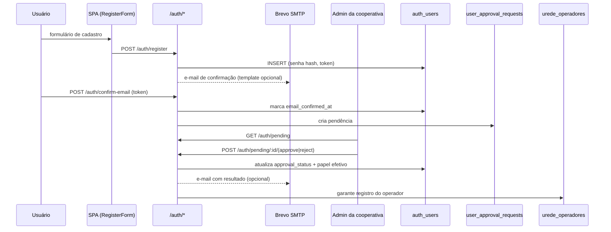
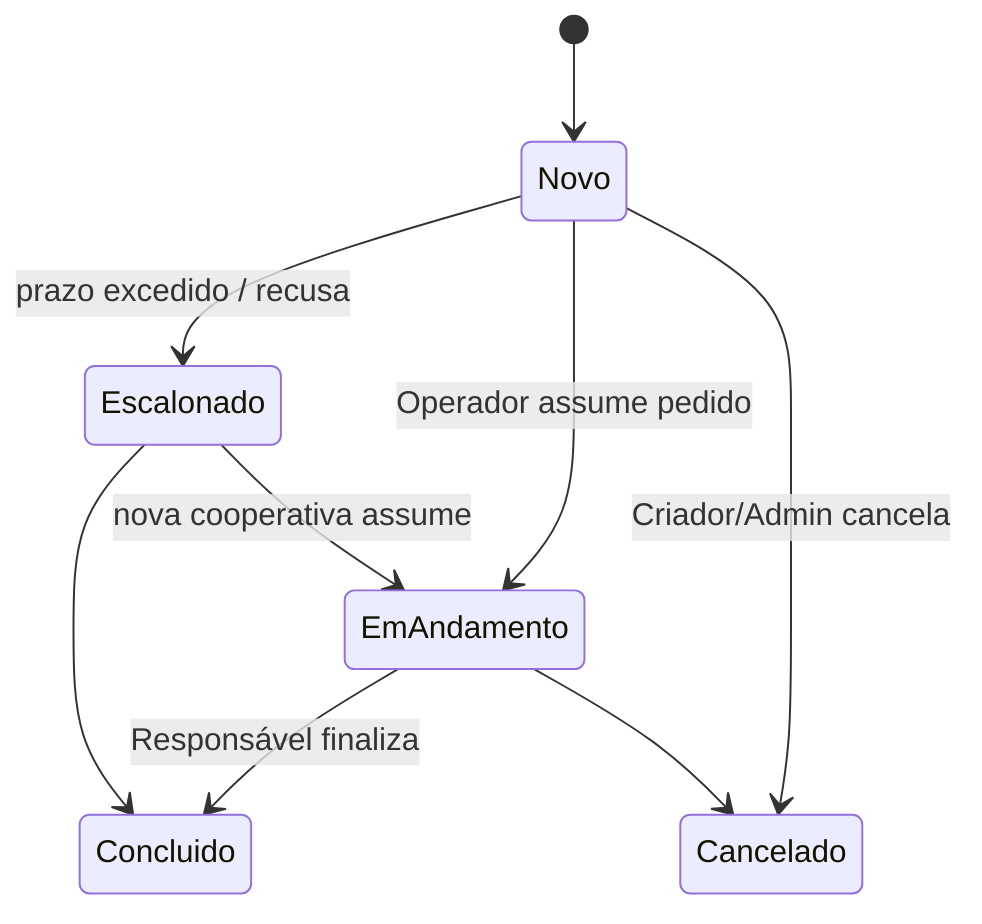
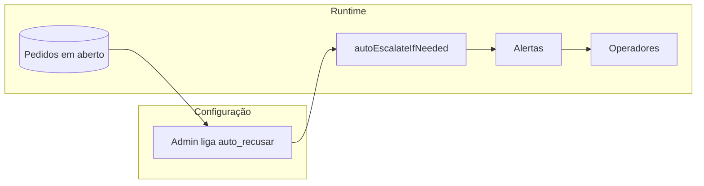

# 3. Fluxos de Dados e Processos de Negócio

## 3.1 Sumário
1. Onboarding e aprovação de usuários
2. Ciclo de vida do pedido de credenciamento
3. Importação em lote e reconciliação
4. Alertas, notificações e auditoria
5. Cobertura de cidades e recusa automática

## 3.2 Onboarding e aprovação
- **Contexto:** novos usuários iniciam o cadastro na tela pública (`src/components/AuthScreen.tsx`).
- **Dados:** `auth_users` armazena senha (bcrypt), `confirmation_token`, `approval_status` e `requested_papel`.
- **Fluxo:**

- **Papéis resultantes:** `operador`, `admin`. O nivel institucional e derivado de `cooperativas.papel_rede`.
- **Recuperação de sessão:** `AuthContext` executa `authService.getSession()` (token no `localStorage`), chama `/auth/me` e mantém `user.approval_status` sincronizado.

## 3.3 Ciclo de vida do pedido
- **Criação:** `NovoPedidoForm.tsx` envia `POST /pedidos`. O backend calcula `prazo_atual = computePrazoLimite(nivel_atual)` e salva `especialidades` em JSON.
- **Estados:** `status ∈ {novo, em_andamento, concluido, cancelado}`. `nivel_atual ∈ {singular, federacao, confederacao}`. `dias_restantes` é recalculado em cada leitura.
- **Atualização:** `PedidoDetalhes.tsx` permite:
  - Alterar status (se responsável autorizado);
  - Adicionar comentário (apendado em `observacoes` com timestamp/autor);
  - Assumir responsabilidade (`responsavel_atual_id/nome`);
  - Transferir manualmente (`POST /pedidos/:id/transferir`).
- **Escalonamento automático:**
  - Timer local + endpoint `/` chamam `escalarPedidos`.
  - `computeEscalationTarget` identifica destino: `singular → federacao` (via `federacao_id`) e `federacao → confederacao` (primeira cooperativa com `papel_rede=CONFEDERACAO`).
  - `applyEscalation` atualiza `nivel_atual`, `cooperativa_responsavel_id`, `prazo_atual` e zera o responsável atual.
  - `dispatchPedidoAlert` registra evento (`urede_alertas`) e envia e-mail notificando envolvidos (responsáveis, criador, admins da cooperativa destino).
- **Conclusão:** ao mudar para `concluido`, o backend calcula `dias_para_concluir` (diferença entre criação e conclusão) e mantém histórico em `urede_auditoria_logs`.

## 3.4 Importação em lote
- **Interface:** `PedidosImportPage.tsx` guia o usuário em quatro etapas (`upload → mapping → review → result`).
- **Parser:** biblioteca `xlsx` converte arquivos `.xlsx`/`.csv` em matriz de dados; `autoDetectMapping` associa cabeçalhos aos campos esperados (`titulo`, `especialidade`, `cidadeCodigo`, `responsavelEmail`, `detalhes`).
- **Validações:**
  - códigos IBGE aceitam 6 ou 7 dígitos (`normalizeIbgeInput` no backend);
  - Especialidades são convertidas para vetor (split em vírgulas ou `;`).
  - Responsável opcional precisa existir ou será ignorado.
- **Processamento:** backend agrupa erros por linha (`PedidoImportError`) e devolve resumo com `durationMs`. As linhas válidas são inseridas via `POST /pedidos`, disparando alertas e auditoria normalmente.
- **Template oficial:** `public/templates/pedidos_lote.csv` deve ser distribuído a parceiros externos para padronizar colunas.

## 3.5 Alertas, notificações e auditoria
- **Eventos rastreados:** criação, atualização de status, mudança de nível, troca de responsável, novos comentários, leitura de alertas.
- **Persistência:** tabela `urede_alertas` guarda `destinatario_email`, `tipo`, `mensagem`, `detalhes`, `lido`, `criado_em`. Há índices para `destinatario_email`, `pedido_id` e `lido`.
- **Despacho:**
  1. `dispatchPedidoAlert` identifica destinatários: criador do pedido, responsáveis atuais, admins/federação relacionados e usuários da cooperativa responsável.
  2. Cria registro em banco e dispara e-mail via Brevo (quando `BREVO_*` configurado). Caso o template não exista, envia HTML simples com link para o pedido.
  3. O frontend (`Layout.tsx`) consulta `/alertas` a cada 60s, atualiza badges e, quando suportado, usa `Notification` API para pop-ups com ação direta.
- **Auditoria:** cada mutação relevante (status, transferência, leitura de alerta) gera entrada em `urede_auditoria_logs` com `usuario_id`, `acao`, `timestamp`, `detalhes`. A tela `PedidoDetalhes` consulta a rota `/pedidos/:id/auditoria` e mostra histórico.

## 3.6 Cobertura de cidades e recusa automática
- **Objetivo:** manter mapa de quais cooperativas atendem cada cidade, com rastreabilidade.
- **Tabelas:** `urede_cidades` (cidade→cooperativa padrão) e `urede_cobertura_logs` (histórico das transferências, com autor/papel e timestamp).
- **Permissões:**
  - `admin` confederacao: gerencia qualquer cooperativa.
  - `admin` federacao: gerencia singulares vinculadas via `federacao_id`.
  - `admin` singular: gerencia apenas a propria cooperativa.
- **Fluxo:**
  1. Usuário acessa `CooperativasView` e solicita alteração de cobertura.
  2. `PUT /cooperativas/:id/cobertura` recebe `cidade_ids[]`, substitui relacionamentos e registra logs com `registrarLogCobertura`.
  3. Caso `auto_recusar` esteja ativo para a cooperativa, `autoEscalatePedidosForCooperativa` move automaticamente todos os pedidos pendentes para o próximo nível.
  4. Logs podem ser auditados via `GET /cooperativas/:id/cobertura/historico`.

- **Uso típico:** federadas que estão atuando apenas como brokers ligam `auto_recusar` para redirecionar automaticamente os pedidos às confederações; singulares conseguem transferir cobertura de cidades quando novas clínicas são homologadas.

## 3.7 Dados institucionais e prestadores
- **Institucional:** dados de contatos, enderecos, diretoria, conselhos, auditoria, ouvidoria, LGPD e plantao. Leitura e global; escrita apenas admins dentro do escopo hierarquico.
- **Prestadores:** consulta publica na base ANS (`prestadores_ans`) e no cadastro enriquecido (`prestadores`). Ligacao com operadoras via `reg_ans` e vinculos por singulares em `prestador_vinculos_singulares`.
